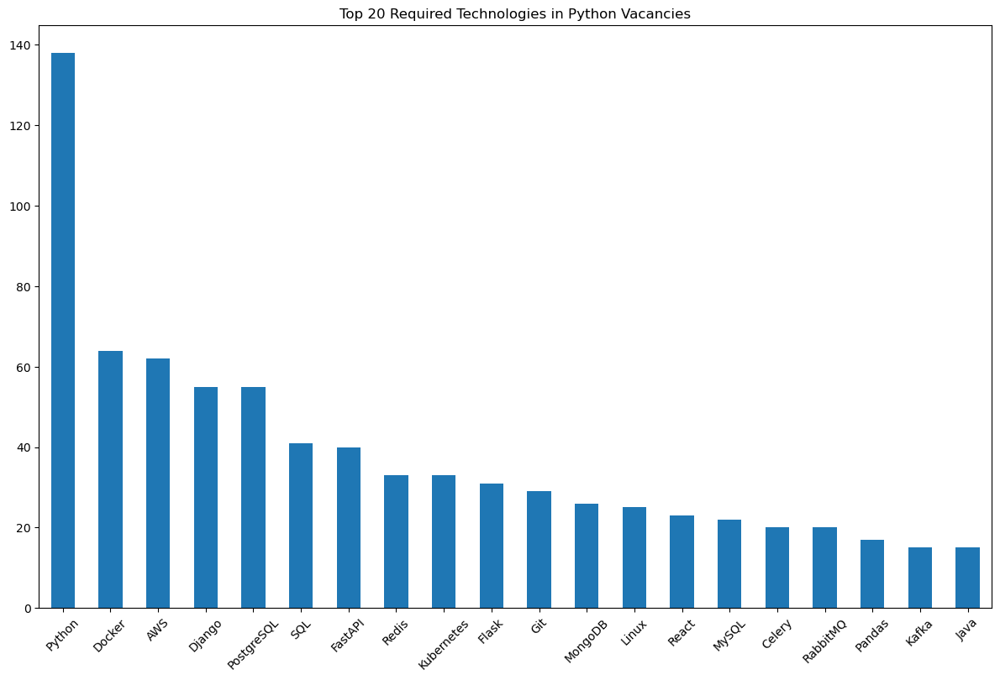

# DOU Python Vacancies analysis

## Overview
The project showed up both Web Scraping and Data Analysis skills. The main goal is to understand the most popular technologies required on Python Vacancies. The main advantage is you are fre to run this script any time you want and you will get an up-to-date dataset at the time of execution.

## Features
* Scrape the list of job vacancies from https://jobs.dou.ua/
* Analyze and plots the most mentioned technologies
* Build plots based on location and experience level



## Installation
1. **Clone the repository**:
   ```bash
   git clone https://github.com/username/job-vacancy-scraper.git
   cd job-vacancy-scraper
   ```
2. **Set up virtual environment**:
    ```bash
    python -m venv venv
    source venv/bin/activate  # On Windows use `venv\Scripts\activate`
    ```
3. **Install dependencies**:
    ```bash
    pip install -r requirements.txt
    ```
4. **Configuration**:
    Modify the config.py file to reach another URL or list of technologies
    
    Note: This script was written to parse https://jobs.dou.ua/ , and unfortunately will not work if you will parse any other site. But you are free to change anything you need


## Usage
Run the script with:
    ```bash
    python parser.py
    ```

This script:

* Opens job URLs using selenium.
* Clicks 'Load more' buttons as needed.
* Collects and cleans job details.
* Saves output in ../data/vacancies.csv.

**Sample CSV Schema**:

The CSV file contains the following columns:

* Title
* Company
* Date
* Url
* City
* Requirements
* Experience

## Configuration

The `config.py` file includes:

* `URLS_EXPERIENCE`: URLs and corresponding experience levels for scraping.
* `CSV_SCHEMA`: Defines the structure of the output CSV.
* `TECHNOLOGIES`: A list of technologies used to identify relevant skills in job descriptions.

---

*Feel free to customize the placeholders, such as Git repository URLs and your name.*
